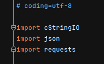
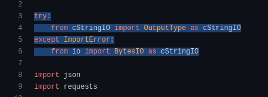

<!-- Improved compatibility of back to top link: See: https://github.com/othneildrew/Best-README-Template/pull/73 -->
<a name="readme-top"></a>
<!--
*** Thanks for checking out the Best-README-Template. If you have a suggestion
*** that would make this better, please fork the repo and create a pull request
*** or simply open an issue with the tag "enhancement".
*** Don't forget to give the project a star!
*** Thanks again! Now go create something AMAZING! :D
-->


<!-- PROJECT SHIELDS -->
<!--
*** I'm using markdown "reference style" links for readability.
*** Reference links are enclosed in brackets [ ] instead of parentheses ( ).
*** See the bottom of this document for the declaration of the reference variables
*** for contributors-url, forks-url, etc. This is an optional, concise syntax you may use.
*** https://www.markdownguide.org/basic-syntax/#reference-style-links
-->


<!-- PROJECT LOGO -->
<br />
<div align="center">
  <a href="https://github.com/petrov8/CareersWebsite">
    
  </a>

<h3 align="center">Careers Website</h3>

  <p align="center">
    project_description
    <br />
    <br />
    <br />
    ·
    <a href="https://github.com/petrov8/issues">Report Bug</a>
    ·
    <a href="https://github.com/petrov8/issues">Request Feature</a>
  </p>
</div>


<!-- TABLE OF CONTENTS -->
<details>
  <summary>Table of Contents</summary>
  <ol>
    <li>
      <a href="#about-the-project">About The Project</a>
      <ul>
        <li><a href="#built-with">Built With</a></li>
      </ul>
    </li>
    <li>
      <a href="#getting-started">Getting Started</a>
      <ul>
        <li><a href="#prerequisites">Prerequisites</a></li>
        <li><a href="#installation">Installation</a></li>
      </ul>
    </li>
    <li><a href="#usage">Usage</a></li>
    <li><a href="#roadmap">Roadmap</a></li>
    <li><a href="#license">License</a></li>
    <li><a href="#contact">Contact</a></li>
  </ol>
</details>


<!-- ABOUT THE PROJECT -->
## About The Project

This is an online exchange where recruiters can publish and manage job advertisements.

Job seekers can browse through available offers, review details and apply (to be implemented). 

The recruitment process is overseen by administrators.


<p align="right">(<a href="#readme-top">back to top</a>)</p>


### Built With

* Client Side - Angular https://angular.io
* Server Side - Flask https://flask.palletsprojects.com/en/2.2.x/


### Services:

* Image Resizing - Kraken.io https://kraken.io
* Image Storage - AWS S3 https://aws.amazon.com/s3/

<p align="right">(<a href="#readme-top">back to top</a>)</p>


<!-- GETTING STARTED -->
## Getting Started


### Prerequisites

1. Clone the repo
   ```sh
   git clone https://github.com/petrov8/CareersWebsite
   ```

Make sure you are running the latest NPM version
* npm
  ```sh
  npm install npm@latest -g
  ```

Ensure you machine has Python3 and pip installed: 
* python 
  ```sh
  python --version 
  pip --version 
  ```
  Alternatively download and install from https://www.python.org/downloads/


### Installation Client Side:

1. Install NPM packages
   ```sh
   npm install
   ```

In case Angular fails to install automatically, run the following command:

2. Install Angular CLI
   ```sh
   npm i @angular/cli
   ```

### Installation Server Side:

1. Install dependencies:    
   ```sh
   pip install -r requirements.txt
   ```

At runtime, the following error may appear: 


  
    


resolve the issue by navigating to "./services/kraken_io.py" and "ALT+left click" on "Client" from "from krakenio import Client" (or CTL + left click on the error) and chsnge:

2. Correct import cStringIO error:    
   ```sh
    try:
        from cStringIO import OutputType as cStringIO
    except ImportError:
        from io import BytesIO as cStringIO
   ```

  change from:

    

  to 

  <p align="center">
    
    
  </p>

    


3. Re-run "main.py"


<p align="right">(<a href="#readme-top">back to top</a>)</p>


<!-- USAGE EXAMPLES -->
## Usage

Users may choose from the following profile options:


Profile Options:

    "Guest" (no login required):
    - Can access job listings with no further details.

    "Job Seeker" (logged in):
    - Can access job listings and additional details.
    - Can update profile information.

    "Recruiter" (logged in):
    - Can access job listings and additional details.
    - Can update profile information.
    - Can publish new jobs.
    - Can edit own publications.
    - Can delete own publications.

    "Administrator" (logged in):
    - Can access job listings and additional details.
    - Can update profile information.
    - Can edit any job listing.
    - Can delete any job listing.


Functionalities:

    "Dashboard": 
    - Shows all basic info for available job postings.

    "Details": 
    - Shows further details about a specific job posting. 

    "My-profile": 
    - Shows personal details of logged-in users. 
    - Profiles can be edited by their owners or by admins.
    - In case user hasn't uploaded a profile picture, a default one will be rendered. 

    "Edit Job": 
    - Allows recruiters to edit their job postings. 
    - Listings can be edited by their owners or by admins.

    "Delete": 
    - Allows recruiters to delete their own job postings. 
    - Listings can be deleted by their owners or by admins.


Features:

    - Image uploads are first converted to base64 format and then then passed by the service side onto an external image resizing API.
    - Different resizing profiles are applied to different use-cases (profile or job image upload)
    - Once the image has been succesfully resized it is then uploaded and stored onto a remote cloud service.
    - A corresponding URL is stored in the database and passed onto the "Client" upon request. 
    - This process helps reduce strain on the server side, standardize image sizing and reduce storage requirements. 


<p align="right">(<a href="#readme-top">back to top</a>)</p>


<!-- ROADMAP -->
## Roadmap

- [1] Delete Profile - Users or Admins can delete profiles (currently not available on server side)
    - [1.1] - Terminate Profile - Administrators have permissions to delete user/recruiter profiles. 
- [2] Apply for jobs - Logged in job seekers can apply for jobs. 
- [3] My Jobs - populates a dashboard of all jobs a job seekers has applied for. 
- [4] Application Count - Recruiters can see total applications for a each of their published jobs.
- [5] Applicant Details - Recruiters can see applicant profiles. 


See the [open issues](https://github.com/github_username/repo_name/issues) for a full list of proposed features (and known issues).

<p align="right">(<a href="#readme-top">back to top</a>)</p>


<!-- LICENSE -->
## License

Distributed under the MIT License. See `LICENSE.txt` for more information.

<p align="right">(<a href="#readme-top">back to top</a>)</p>


<!-- CONTACT -->
## Contact

Angel Petrov - a.petrov089@outlook.com

Project Link: [https://github.com/petrov8](https://github.com/petrov8/CareersWebsite)

<p align="right">(<a href="#readme-top">back to top</a>)</p>


<!-- MARKDOWN LINKS & IMAGES -->
<!-- https://www.markdownguide.org/basic-syntax/#reference-style-links -->
[contributors-shield]: https://img.shields.io/github/contributors/github_username/repo_name.svg?style=for-the-badge
[contributors-url]: https://github.com/github_username/repo_name/graphs/contributors
[forks-shield]: https://img.shields.io/github/forks/github_username/repo_name.svg?style=for-the-badge
[forks-url]: https://github.com/github_username/repo_name/network/members
[stars-shield]: https://img.shields.io/github/stars/github_username/repo_name.svg?style=for-the-badge
[stars-url]: https://github.com/github_username/repo_name/stargazers
[issues-shield]: https://img.shields.io/github/issues/github_username/repo_name.svg?style=for-the-badge
[issues-url]: https://github.com/github_username/repo_name/issues
[license-shield]: https://img.shields.io/github/license/github_username/repo_name.svg?style=for-the-badge
[license-url]: https://github.com/github_username/repo_name/blob/master/LICENSE.txt
[linkedin-shield]: https://img.shields.io/badge/-LinkedIn-black.svg?style=for-the-badge&logo=linkedin&colorB=555
[linkedin-url]: https://linkedin.com/in/linkedin_username
[product-screenshot]: images/screenshot.png
[Next.js]: https://img.shields.io/badge/next.js-000000?style=for-the-badge&logo=nextdotjs&logoColor=white
[Next-url]: https://nextjs.org/
[React.js]: https://img.shields.io/badge/React-20232A?style=for-the-badge&logo=react&logoColor=61DAFB
[React-url]: https://reactjs.org/
[Vue.js]: https://img.shields.io/badge/Vue.js-35495E?style=for-the-badge&logo=vuedotjs&logoColor=4FC08D
[Vue-url]: https://vuejs.org/
[Angular.io]: https://img.shields.io/badge/Angular-DD0031?style=for-the-badge&logo=angular&logoColor=white
[Angular-url]: https://angular.io/
[Svelte.dev]: https://img.shields.io/badge/Svelte-4A4A55?style=for-the-badge&logo=svelte&logoColor=FF3E00
[Svelte-url]: https://svelte.dev/
[Laravel.com]: https://img.shields.io/badge/Laravel-FF2D20?style=for-the-badge&logo=laravel&logoColor=white
[Laravel-url]: https://laravel.com
[Bootstrap.com]: https://img.shields.io/badge/Bootstrap-563D7C?style=for-the-badge&logo=bootstrap&logoColor=white
[Bootstrap-url]: https://getbootstrap.com
[JQuery.com]: https://img.shields.io/badge/jQuery-0769AD?style=for-the-badge&logo=jquery&logoColor=white
[JQuery-url]: https://jquery.com 