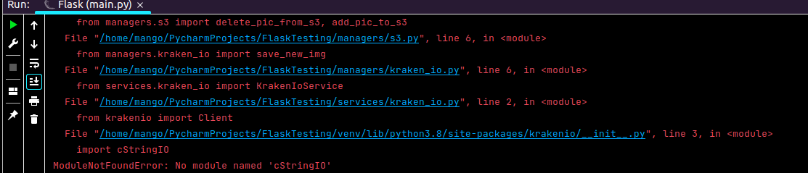

# RECRUITMENT WEBSITE     

## Repo Branches:

  * FrontEnd JS - "frontend"
  * BackEnd Python - "backend"

## Getting Started:

  * DEPENDENCIES: 
     - In IDE terminal:
       > pip install -r requirements.txt  

  * POTENTIAL ISSUES: 
     - 3rd party service Kraken_IO:  
        > missing "cStringIO" error.  
    
       - navigate to: 
            "./services/kraken_io.py" and "ALT+left click" on "Client" from "from krakenio import Client"  
       - Once in the "\_\_init\_\_.py" replace:  
            > import cStringIO  
       
       - with the following script: 

             try:
                from cStringIO import OutputType as cStringIO
             except ImportError:
                from io import BytesIO as cStringIO

       - run "main.py" once again

         
         
         

   

## Project Summary:

  - This is an online exchange where recruiters can publish job advertisements and meet potential job candidates. 
  - The recruitment process is overseen by Administrators or master users.

    * USER PROFILES: 
    
      - "Guest" (no login): 
          - Can access job listings with no further details.
      - "Job Seeker" (logged in):
          - Can access job listings and additional details. 
          - Can update profile information. 
      - "Recruiter" (logged in):
          - Can access job listings and additional details. 
          - Can update profile information. 
          - Can publish new jobs.
          - Can edit own publications.
          - Can delete own publications.
      - "Administrator" (logged in):
          - Can access job listings and additional details. 
          - Can update profile information. 
          - Can edit any job listing.
          - Can delete any job listing. 

    * FEATURES:
    
      - "Dashboard": shows all available job postings.
      - "Details": shows further details about a specific job posting. 
      - "My-profile": shows user details (logged-in users only).
        in case the user hasn't uploaded a profile photo, a default one will be designated. 
      - "Edit": allows recruiters to edit their job postings. A listing can only be edited by the person 
        who has created it in the first place or by an Administrator. 
      - "Delete": allows recruiters to delete their job postings. A listing can only be deleted by the person 
        who has created it in the first place or by an Administrator.
  

    * IMAGE UPLOAD:
    
      - Uploaded image are first converted into "base64" format and then passed onto an external image resizing service.
      - The app distinguished between two image use cases: profile picture or job posting.
        Depending on the exact case, a pre-defined image profile will be passed onto the resizing API service. 
        The aim of the process is dimensions consistency and reducing initial image sizes.
      - The resized file is then uploaded on to an external repository. 
      - A corresponding URL is then saved into the database and is made available upon request. 
    
   

## 3rd Party Services:
  - KrakenIO: image resizing API tool.
  - AWZ S3: image storage repository. 

## Built With:
  - FLASK
  - Python 3.8

## Future Development: 
  - "Job Seekers" can apply for jobs 
  - "Job Seekers" can see a list of jobs they have applied for.
  - "Recruiters" can see applications count.
  - "Recruiters" can see applicant profiles. 
  - Profiles can be deleted
  - "Administrators" can terminate profiles

 ## Licence:
  - Open Source

## Contact:
  - email: a.petrov@outlook.com

